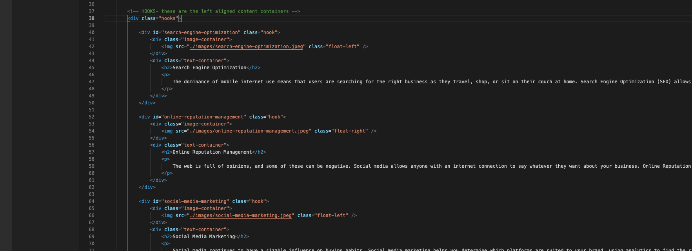
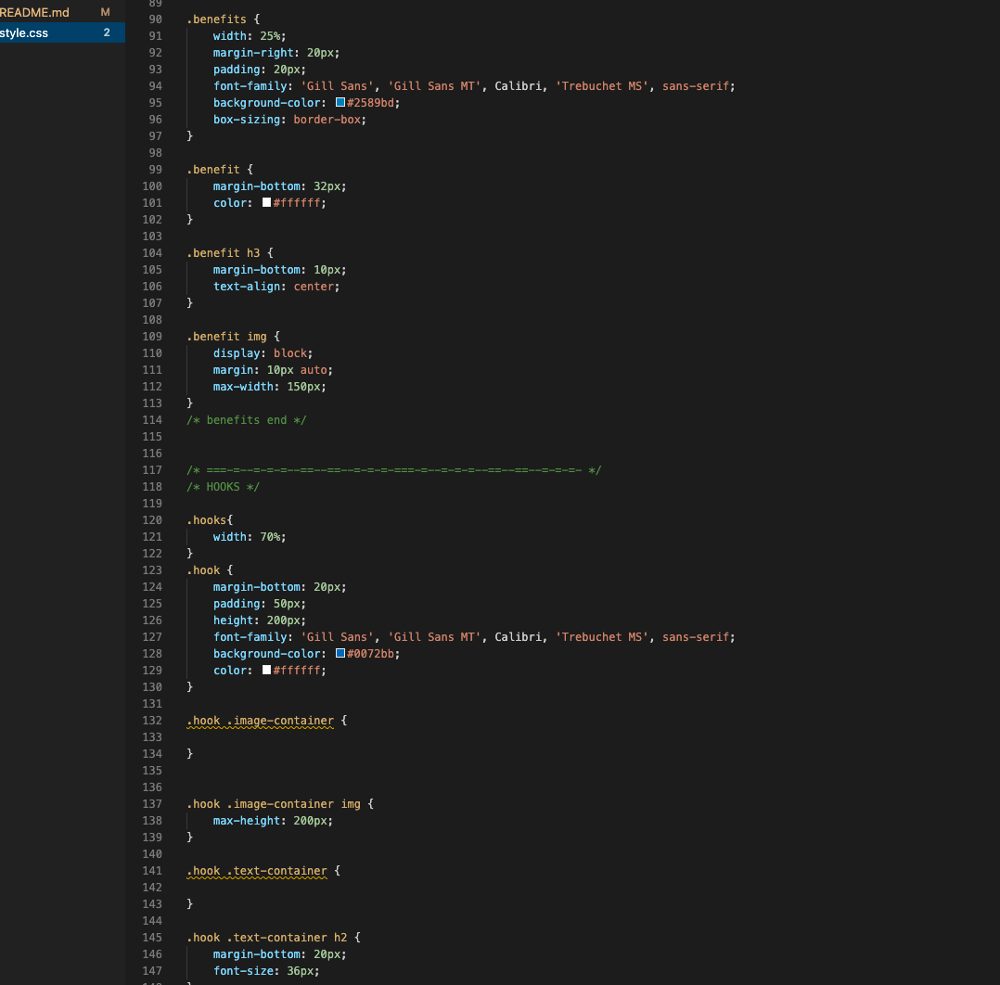
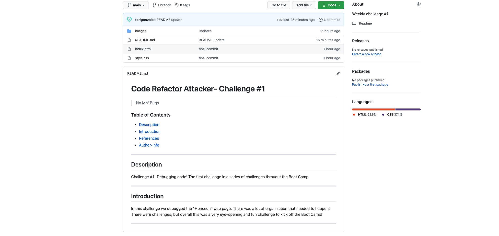

# Code Refactor Attacker- Challenge #1

> No Mo' Bugs 

### Table of Contents 

- [Description](#description)
- [Introduction](#introduction)
- [Challenges](#challenges)
- [Victories](#victories)
- [Resource](#resources)
- [Author-Info](#author-info)

---

## Description 
Challenge #1- Debugging code! 
The first challenge in a series of challenges throuout the Boot Camp. 

---

## Introduction 
In this challenge we debugged the "Horiseon" web page. There was a lot of organization that needed to happen! There were challenges, but overall this was a very eye-opening and fun challenge to kick off the Boot Camp! 

---

## Challenges 
I found that there was a lot of organization that needed to happen within the starter HTML and CSS code. There was a lot of unnecessary and repeat syntax. Here a good example what it should look like:
 

---

## Victories 
I finally have a better understanding of GitHub! I was able to "Push" my work, and commit it as well!

Here is the final look of the page after debugging! 

---

## Resources
<a href="https://github.com/torigonzales/challenge1">GitHub Repo</a>

<a href="https://torigonzales.github.io/challenge1/"> Horiseon</a>

<a href="https://www.youtube.com/watch?v=eVGEea7adDM"> YouTube</a>

<a href="https://www.google.com/webhp?hl=en&sa=X&ved=0ahUKEwiLjJ7fosLvAhWXW80KHawRD_oQPAgI">Google</a>
